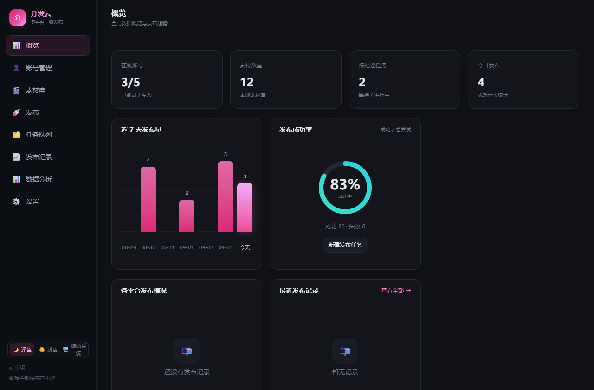
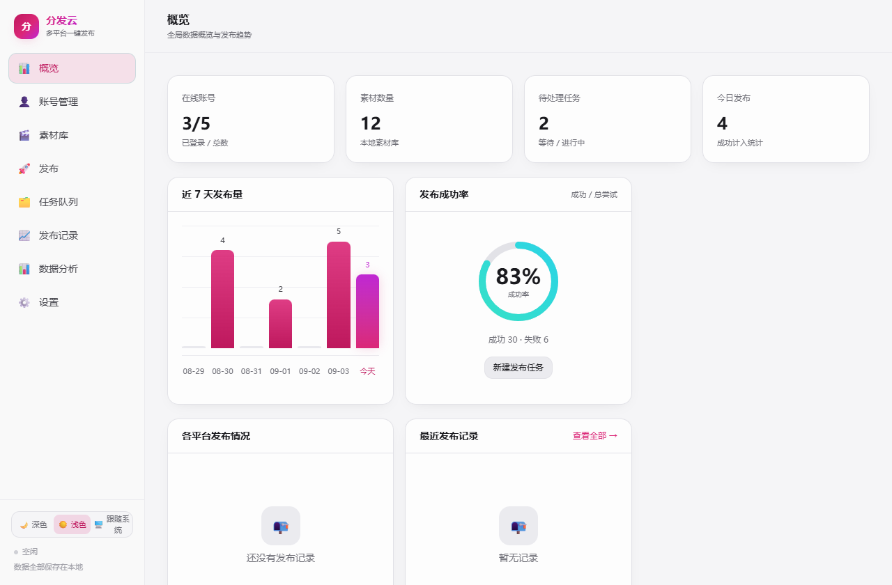
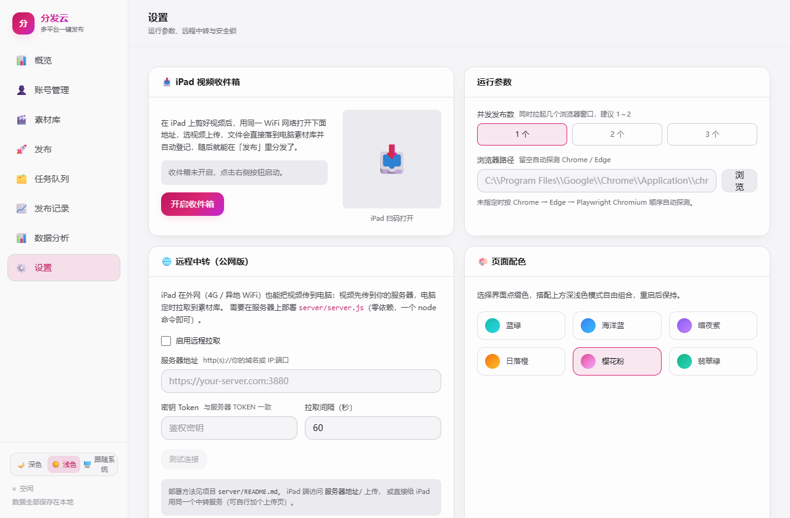

# 分发云

多平台短视频一键分发桌面工具：覆盖 **29 个平台**（抖音 / 快手 / B 站 / 小红书 / 视频号 /
西瓜 / 头条 / 百家号 / 企鹅号 / 大鱼号 / 爱奇艺号 / 优酷号 / 搜狐号 / 网易号 / 微博 / 知乎 /
好看视频 / AcFun / 微视 + YouTube / TikTok / Instagram / Facebook / X / Vimeo /
Dailymotion / Rumble / LinkedIn / Pinterest）。

多账号、定时发布、素材库、发布记录，以及**作品数据深度分析**（播放 / 点赞 / 评论 / 转发 / 收藏 / 涨粉）。
全部数据保存在本地。

## 界面预览

| 深色 | 浅色 | 配色方案 |
| --- | --- | --- |
|  |  |  |

深浅色 + 6 套点缀配色（蓝绿 / 海洋蓝 / 暗夜紫 / 日落橙 / 樱花粉 / 翡翠绿）自由组合，另含启动密码锁。

## 技术栈

| 层 | 选型 | 说明 |
| --- | --- | --- |
| 桌面壳 | Electron 33 | 跨平台桌面容器 |
| 构建 | electron-vite + esbuild | 主进程 / 预加载 / 渲染层 / Worker 四套产物 |
| 界面 | React 18 + TypeScript + Tailwind v4 | 深色控制台风格 |
| 数据 | better-sqlite3 | 本地 SQLite，账号、素材、任务、日志、作品指标 |
| 自动化 | playwright-core | 驱动本机 Chrome / Edge，拟人化操作 |

## 平台自动化分级

不同平台页面复杂度差异大，按自动化程度分三档（见「账号管理 → 添加账号」的标记）：

- **全自动（full）**：抖音 / 快手 / B 站 / 小红书 / 视频号 / YouTube / TikTok，有专用适配器，选择器调过。
- **通用（generic）**：西瓜 / 头条 / 百家号 / 企鹅号 / 大鱼号 / 爱奇艺 / 优酷 / 搜狐 / 网易 / AcFun /
  微博 / 知乎 / 好看 / 微视 / Vimeo / Dailymotion / Rumble，走配置驱动的通用适配器，多数能跑通全流程。
- **人工兜底（assist）**：Instagram / Facebook / X / LinkedIn / Pinterest，页面复杂或风控严，
  自动上传 + 填表后停下，由你手动点发布。

> 防止被盗视频的关键是"占位"——同一内容铺到越多平台，被搬运号抢先发布的概率越低。
> 建议矩阵号场景优先把 `full` + `generic` 的平台全部铺满。

## 架构

```
src/
├─ shared/          主进程与渲染层共用的类型、平台元信息（29 平台注册表）
├─ main/
│  ├─ index.ts      窗口与生命周期
│  ├─ db.ts         SQLite schema + CRUD + 统计 + 作品指标
│  ├─ paths.ts      数据目录 / 账号 profile 目录
│  ├─ task-runner.ts发布队列（并发控制、进度回传、取消、单条重发）
│  ├─ scheduler.ts  定时任务扫描
│  ├─ worker-bridge.ts  自动化子进程封装
│  └─ ipc/          account / material / task / file / settings / analytics
├─ worker/          独立子进程，跑浏览器自动化，崩溃不影响主界面
│  ├─ browser.ts    浏览器探测 + 反检测启动
│  ├─ humanize.ts   拟人化操作（随机延迟、真实鼠标轨迹、逐字输入）
│  └─ platforms/    平台适配器：7 个专用 + 1 个通用（配置驱动）+ 1 个人工兜底
├─ preload/         contextBridge 暴露受控 API
└─ renderer/        React 界面（含数据分析页）
```

## 快速开始

```bash
npm install
npm run dev      # 开发模式
npm run build    # 构建产物
npm run dist     # 打包 Windows 安装包
```

## 使用流程

1. **账号管理**：添加账号 → 点「登录」→ 在弹出的浏览器窗口完成扫码/手机号登录 → 关闭窗口 → 点「检测」确认状态。
   每个账号使用独立浏览器 profile，登录态长期保存。登录检测时会自动抓取账号头像，
   粉丝数可在账号卡片上点击手动同步。
2. **iPad 收件箱**：在 iPad 上剪好视频后，到「设置 → iPad 收件箱」点「开启收件箱」，
   用 iPad（同一 WiFi）扫码或输入地址打开网页，选视频上传，文件直接落到电脑素材库并自动登记。
   可设置 4 位上传 PIN，二维码会自动带上，防同网段陌生人投喂。
3. **素材库**：把常用视频登记进来，发布时一键选用。
4. **发布**：填写标题、简介、话题，勾选目标账号（可跨 29 平台多选），立即发布或定时发布。
5. **任务队列**：实时查看每个账号的上传进度、成功/失败原因。
6. **数据分析**：发布成功后点「录数据」录入播放/点赞等，自动生成作品榜、账号表现、
   平台播放量对比、发布时间分布、单作品趋势曲线。

## 数据分析说明

播放量 / 点赞等数据**无法靠浏览器自动化稳定抓取**（平台风控严、改版频繁、易触发验证码），
因此采用两层设计：

- **手动录入 + 自动累计**：发布成功后，你在「数据分析」页点「录数据」，把后台看到的数字填进去，
  支持多次录入形成时间序列，自动产出趋势图、涨粉曲线、最优发布时间、账号对比。100% 可用，不碰风控。
- **官方 API 预留**：YouTube 等有官方数据 API 的平台，接口层已按此架构预留，
  后续接入 API Key 即可自动拉取（需自行申请 Google Cloud 项目与 OAuth 授权）。

## iPad 工作流说明

工具通过「局域网收件箱」打通 iPad → 电脑的链路：iPad 剪完视频，用同一 WiFi 扫码上传到电脑，
自动进素材库，之后在电脑上发布。之所以不做 iPad 直接发布，是因为各平台在 iPad 上用官方 App
发布体验更好、更稳，且工具无法远程驱动 iPad 上的 App；本地传文件是最高效可靠的衔接方式。

### 公网中转（外网也能传）

如果 iPad 和电脑不在同一网络（4G / 异地），用「远程中转」：

1. 把 `server/server.js` 部署到你的服务器（零依赖，`node server.js` 即可，详见 `server/README.md`）。
2. 工具「设置 → 远程中转」填服务器地址 + 密钥，点「测试连接」。
3. iPad 打开服务器地址上传视频（服务器自带上传页），电脑端定时拉取到素材库自动登记。

`server.js` 支持环境变量 `PORT` / `TOKEN` / `DATA_DIR` / `MAX_SIZE` / `TTL_HOURS`（滞留文件自动清理小时数，默认 72），建议务必设置 `TOKEN` 鉴权。

## 新增平台

1. 在 `src/shared/platforms.ts` 的 `PLATFORMS` 里加一条元信息（含 `level`、`loginUrl`、`uploadUrl` 等）。
2. 若需要精确控制，在 `src/worker/platforms/` 新建适配器并在 `index.ts` 的 `dedicated` 里注册；
   否则把 `level` 设为 `generic` 或 `assist` 走通用/兜底适配器，界面会自动出现该平台。

## 安装与兼容性

提供两种产物（均位于 `release/`，文件名用 ASCII，QQ/微信/网盘传输不乱码）：

| 产物 | 适用场景 |
| --- | --- |
| `fenfayun-setup-<版本>-win-x64.exe` | 常规安装版（NSIS，可选安装目录、桌面/开始菜单快捷方式） |
| `fenfayun-portable-<版本>-win-x64.exe` | 单文件绿色版，双击即用，适合 U 盘 / 不便安装软件的电脑 |

- **系统要求**：Windows 10 / 11 x64（Electron 33 不支持 Win7/8）；需本机装有
  Chrome 或 Edge 任一（绝大多数电脑自带 Edge）。
- **浏览器探测**：按 Program Files → 用户目录 → 注册表 App Paths 顺序探测，
  浏览器装在 D 盘等自定义位置也能找到；仍找不到可在「设置 → 浏览器路径」手动指定。
- **老显卡 / 远程桌面白屏**：开启「设置 → 窗口与自启 → 兼容模式」重启即好；
  若连续两次启动异常，应用会自动进入兼容模式（关闭硬件加速）并提示，
  不会陷入"打不开"死循环；也可用 `分发云.exe --compat` 强制兼容启动。
- **数据目录**：默认在 `%APPDATA%\分发云data`（任何账户都有写权限，
  装到 Program Files 也不需管理员）。想当绿色版用：在 exe 旁建一个
  `portable-data` 文件夹，数据就会跟随 exe 走（U 盘携带账号与素材记录）；
  目录变只读时自动回落默认目录并留下提示文件。
- **代码签名**：未签名。首次运行如遇 SmartScreen，点「更多信息 → 仍要运行」。

## 注意事项

- 各平台上传页会不定期改版，若某平台发布失败且提示"未找到上传入口"，
  通常是页面结构变化，更新对应适配器里的选择器即可。失败记录附带的
  「截图」按钮能直接看到失败现场的页面样子，定位改版更快。
- 发布失败会自动重试（设置里 0～3 次，退避 30/90/180 秒）；同一账号的任务
  自动串行，不会互相挤掉登录态。
- 遇到滑块 / 拼图验证码时浏览器会保持打开，完成验证后流程自动继续。
- 定时发布：勾选「交给平台侧定时」（平台支持时）内容会提前挂到平台自己的
  定时器上，App 关着也能发；否则依赖本工具保持运行——建议开启
  「关闭到托盘」+「开机自动启动」，关机期间错过的任务下次启动自动补发。
- TikTok / YouTube 等海外平台在「设置 → 网络代理」或账号编辑里配置代理。
- 发布过程中不要关闭自动弹出的浏览器窗口，否则对应任务会失败。
- `assist` 级平台（Instagram/Facebook/X 等）发布时会自动填好内容并等你
  手动点发布，工具会自动检测发布结果，成功即记成功。

